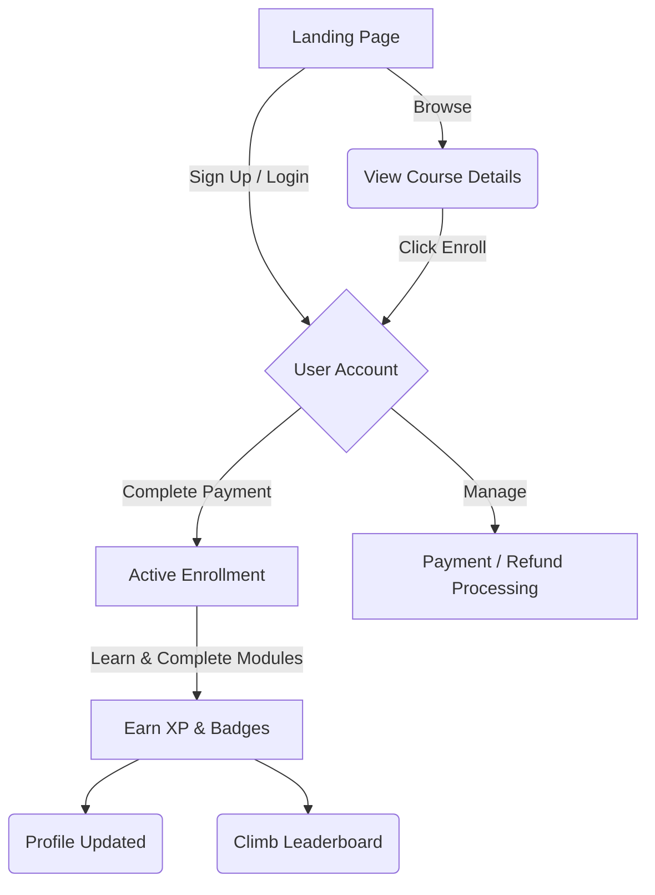

# InternifyGroup

**A Gamified Learning Platform for Software Development**

Welcome to InternifyGroup! This platform is built to make learning software development interactive, competitive, and highly rewarding. Instead of just reading tutorials, users can master tech stacks, earn XP, unlock badges, and climb the global leaderboard.

**Live MVP:** [https://internifygroup.vercel.app/](https://internifygroup.vercel.app/)

---

## Tech Stack

Built with a modern and scalable tech stack:

- **Frontend**: [Next.js (App Router)](https://nextjs.org) & React
- **Styling**: [Tailwind CSS](https://tailwindcss.com/) & [Framer Motion](https://www.framer.com/motion/) for micro-animations
- **Backend & Auth**: [Firebase](https://firebase.google.com/) (Firestore & Firebase Authentication)
- **Deployment**: [Vercel](https://vercel.com/)

---

## Key Features

- **Gamified Experience**: Learn by doing. Complete course milestones to earn XP and level up.
- **Global Leaderboard**: See how you rank against other developers. 
- **Badges & Achievements**: Unlock custom badges (like *First Login*, *3-Day Streak*, *React Beginner*) on your personalized profile.
- **Interactive Courses**: Browse and enroll in curated Software Development courses ranging from Frontend Mastery to Backend Architecture.
- **Secure Authentication**: Fast and reliable user registration and login powered by Firebase Auth.

---

## Platform Flow

---

## Database Architecture (Firebase Firestore)

The platform utilizes a comprehensive NoSQL document database schema designed for scale, supporting everything from real-time gamification tracking to financial transactions and mentor-student relationships.

### `users` (Collection)
Stores comprehensive profiles for both Students and Mentors.
- `uid` (String) - Firebase Auth User ID
- `email` (String) - User's email address
- `role` (String) - `"student"` | `"mentor"` | `"admin"`
- `profile` (Map) - `firstName`, `lastName`, `avatarUrl`, `bio`, `githubLink`
- `stats` (Map) - `totalXP`, `globalRank`, `currentStreak`
- `createdAt` (Timestamp) - Account creation date
- `lastActive` (Timestamp) - Last login timestamp

### `badges` (Collection)
Master registry of all available gamification badges.
- `badgeId` (String) - Unique identifier (e.g., `first-login`)
- `name` (String) - Display name (e.g., "React Beginner")
- `description` (String) - Criteria to unlock
- `iconUrl` (String) - Path to badge image
- `xpReward` (Number) - XP awarded upon unlocking

### `user_badges` (Subcollection under `users`)
Tracks badges unlocked by specific users.
- `badgeId` (String) - Reference to `badges` collection
- `earnedAt` (Timestamp) - When the badge was unlocked

### `courses` (Collection)
Stores metadata for available learning modules and paths.
- `courseId` (String) - Unique slug (e.g., `frontend-mastery`)
- `title` (String) - Display name of the course
- `description` (String) - Detailed syllabus
- `price` (Number) - Cost of the course
- `mentorId` (String) - Reference to the creator/mentor `uid`
- `enrolledCount` (Number) - Total active students
- `rating` (Number) - Average student rating (0-5)

### `enrollments` (Collection)
Maps students to courses, tracking individual progress.
- `enrollmentId` (String) - Unique ID
- `studentId` (String) - Reference to student `uid`
- `courseId` (String) - Reference to course `courseId`
- `progressPercentage` (Number) - 0 to 100
- `status` (String) - `"active"` | `"completed"` | `"refunded"`
- `enrolledAt` (Timestamp)

### `payments` (Collection)
Immutable ledger of all financial transactions.
- `paymentId` (String) - Unique transaction ID
- `userId` (String) - Student who made the purchase
- `courseId` (String) - Course purchased
- `amount` (Number) - Transaction amount
- `currency` (String) - e.g., `"USD"`, `"INR"`
- `status` (String) - `"success"` | `"pending"` | `"failed"`
- `paymentMethod` (String) - e.g., `"stripe"`, `"razorpay"`
- `timestamp` (Timestamp)

### `refunds` (Collection)
Handles course refund requests and processing.
- `refundId` (String) - Unique refund ID
- `paymentId` (String) - Reference to original `paymentId`
- `userId` (String) - Student requesting refund
- `reason` (String) - Explanation for refund
- `amount` (Number) - Amount to be refunded
- `status` (String) - `"requested"` | `"approved"` | `"rejected"`
- `processedAt` (Timestamp) - When the refund was finalized

### `leaderboards` (Collection)
Historical snapshots for weekly and monthly rankings to ensure fast queries without recalculating all XP.
- `periodId` (String) - e.g., `"2024-W12"` (Week 12 of 2024)
- `userId` (String) - Reference to user `uid`
- `xpEarned` (Number) - XP earned in this specific period
- `rank` (Number) - Position on the leaderboard
- `tier` (String) - `"bronze"` | `"silver"` | `"gold"` | `"diamond"`

---

## The Team

Our platform is brought to life by the following contributions:

- **Aashika Jain** – Feature thinking & MVP Definition
- **Abhishek Joy** – Wireframes & Workflow Diagram
- **Agampreet Singh** – Code & Database Architecture
